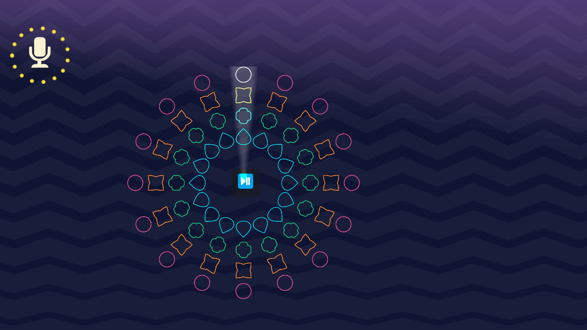

# Ritme Robot: Beat Sequencer

This is part of a bigger project made in Godot. Here is a short YouTube movie about it.
[](https://www.youtube.com/watch?v=iRv_gMA9cPs)

Ritme Robot enables children to create their own music, assisted by Klappy, the digital AI coach. Since Ritme Robot requires no prior musical knowledge or experience, the app enhances the musical—and thus creative—abilities of all players. The various features of the app contribute to stimulating and strengthening creativity.

## Project overview



In this open-source code, you can easily make your own beat with a 16-step sequencer.
- The pink circle is the Kick
- The orange is the Clap
- The Green is the snare
- The blue is the hihat.

Next to that, you can record your own voice that's synced with the beat. 
Under the hood, you can also record your own samples.

*The sounds are recorded by us and are free to use.*

## 📦 Installation

1. Install [Godot 4.5](https://godotengine.org/download/archive/4.5-stable)
2. Clone repo
```bash
git clone https://github.com/Monobanda/RitmeRobot-beat-sequencer.git
```
3. Open project folder `RitmeRobot-beat-sequencer`
4. Press play

## System Architecture Overview

The following diagram illustrates the core classes and relationships within the project.

```mermaid
classDiagram
    class AudioTrack {
        +Array[AudioStreamPlayer] players
        +audio_bank bank
        +beat_ring_button_resource beat_ring_resource
        +audio_track_resource track_resource
        +int primary_player
        +int recording_player
        +_ready()
        +_on_play(resource)
        +_set_player_volumes()
        +_get_players_volumes()
        +_setup_players()
        +_fill_players(_bank)
        +_on_set_rec_synth(recording, resource)
        +_on_play_synth(_time, resource)
        +_on_stop_synth()
        +_on_stop_all_player()
    }

    class GameComposer {
        +bool started_game
        +signal start_game()
        +signal use_back_up()
        +signal set_rec_synth(recording, resource)
        +signal play_synth(_time, resource)
        +signal stop_synth()
        +signal play_ring_type(resource)
        +signal stop_all_players()
        +signal retrieve_seconds()
        +signal retrieve_note_length()
        +signal retrieve_notes_per_beat()
        +signal set_seconds(sec)
        +signal set_note_length(note_length)
        +signal set_notes_per_beat(notes)
        +signal change_note_active_status(beat_ring_enum, note)
        +signal prepare_for_recording()
        +signal loop_completed()
        +signal change_play_state(active)
        +signal start_countdown(time, note, length)
        +_ready()
        +_on_start_game()
    }

    class AudioComposer {
        +Array[AudioStreamPlayer] stomp_ring_players
        +Array[AudioStreamPlayer] klap_ring_players
        +Array[AudioStreamPlayer] snare_ring_players
        +Array[AudioStreamPlayer] hihat_ring_players
        +Array[AudioStreamPlayer] green_synth
        +audio_bank bank
        +audio_bank backup_bank
        +var green_rec
        +int green_index
        +int purple_index
        +Node2D stomp_ring
        +Node2D klap_ring
        +Node2D snare_ring
        +Node2D hihat_ring
        +int primary_player
        +int recording_player
        +_ready()
        +_on_play(ring_type)
        +_set_player_volumes()
        +_get_players_volumes()
        +_setup_players(ring_player, bus)
        +_fill_players(_bank)
        +_on_set_rec_synth(recording)
        +_on_play_synth(_time)
        +_on_stop_synth()
        +_on_stop_all_player()
    }

    class Sequencer {
        +float bpm
        +int notes_per_beat
        +float beat_length
        +float note_length
        +int beats_per_section
        +Dictionary[String, int] notes
        +int current_note
        +bool first_note
        +const int fixed_seconds
        +float seconds
        +float _total_time
        +Timer ring_timer
        +String kick_ring_string
        +String klap_ring_string
        +String snare_ring_string
        +String hihat_ring_string
        +int _beat
        +bool playing
        +Array[bool] kick_ring
        +Array[bool] klap_ring
        +Array[bool] snare_ring
        +Array[bool] hihat_ring
        +bool record
        +signal set_song_settings(bank)
        +_ready()
        +_set_array_sizes()
        +_set_value_notes_dictionary_for_ring_strings()
        +_calculate_beat_and_note_length()
        +_process(delta)
        +_on_change_play_state(active)
        +_on_change_note_active_status(beat_ring_enum, note)
        +_reset_dictionary()
        +_on_play(ring_array, ring_string, ring_player)
        +_emit_on_play(ring_array, ring_string, ring_type)
        +_reset_counters()
        +_check_allowed_play_on_dictionary_value(array, string)
        +_setup_timer(timer)
        +_on_timeout()
        +_on_set_song_setting(bank)
        +prepare_for_recording()
        +on_loop_completed()
        +_on_retrieve_seconds()
        +_on_retrieve_note_length()
        +_on_retrieve_notes_per_beat()
    }

    class VoiceRecording {
        +Node2D play_button
        +AudioEffectRecord effect
        +var recording
        +float rec_time
        +Button rec_button
        +AudioEffectCapture back_up_effect
        +bool is_recording
        +Array data
        +bool back_up
        +float capture_mix_rate
        +Timer count_down
        +var note_length
        +var notes_per_beat
        +_ready()
        +_process(_delta)
        +setup_effect()
        +setup_effect_backup()
        +_start_recording()
        +_on_timer_timeout()
        +_on_set_rec_button(button)
        +_create_timer()
        +on_set_note_Length(length)
        +on_set_notes_per_beat(notes)
        +convert_to_wav(audio_data)
        +record_on_Sequencer()
        +_on_voice_button_pressed()
    }

    class BeatRingButton {
        +Sprite2D ring
        +Sprite2D filling
        +beat_ring_button_resource resource
        +Vector2 button_scale
        +AudioStreamPlayer back_up_player
        +int index
        +bool active
        +bool audio_backup
        +_ready()
        +_on_texture_button_pressed()
        +_on_area_2d_area_entered(_area)
        +_on_audio_back_up()
        +_get_index()
        +rotate_based_on_index()
    }

    class Countdown {
        +Timer timer
        +Label label
        +float time
        +float delay
        +_ready()
        +start_countdown(max_time, note_length)
        +stop_countdown()
        +on_loop_completed()
        +_timeout()
    }

    class PlayPauseButton {
        +bool _active
        +Node2D play_pause_button
        +signal play_button_pressed()
        +float seconds
        +_ready()
        +_on_play_pause_button_pressed()
        +_print_midi_info(midi_event)
        +_input(input_event)
        +on_set_seconds(sec)
    }

    class Pointer {
        +bool active
        +float seconds
        +float note_length
        +var notes_per_beat
        +_ready()
        +_process(_delta)
        +_on_change_play_state(state)
        +on_set_seconds(_sec)
        +on_set_notes_length(_note_length)
        +on_set_notes_per_beat(_notes)
    }

    class AudioBank {
        +AudioStream kick
        +AudioStream klap
        +AudioStream snare
        +AudioStream hihat
    }

    class AudioTrackResource {
        +synths synth
        +audio_bank back_up_bank
    }

    class BeatRingButtonResource {
        +audio_bank back_up_bank
        +ring_types type_ring
        +Texture Empty
        +Texture Filled
        +get_bus_name()
    }

    class Synths {
        <<enumeration>>
        GREEN
    }

    class RingTypes {
        <<enumeration>>
        KLAP
        STOMP
        HIHAT
        SNARE
        GUITAR
    }

    class BeatsAmountResource {
        +int beats_amount
    }

    AudioTrackResource --> Synths
    BeatRingButtonResource --> RingTypes

    class EffectProfile {
        +float pitch_shift
        +float distortion_db
        +float phaser
        +float delay
        +float reverb
        +apply(bus_index)
    }

    class SoundSetting {
        +String name
        +int bpm
        +Array[String] themes
        +Array[String] emotions
        +int swing
        +int electronic_level
    }

    class SoundSettingMap {
        +Dictionary[audio_bank, sound_setting] sounds
    }

    AudioTrack --> AudioBank
    AudioTrack --> AudioTrackResource
    AudioTrack --> BeatRingButtonResource
    AudioComposer --> AudioBank
    AudioComposer --> BeatRingButtonResource
    AudioTrackResource --> AudioBank
    BeatRingButtonResource --> AudioBank
    Pointer ..> GameComposer
    PlayPauseButton ..> GameComposer
    BeatRingButton ..> GameComposer
    Countdown ..> GameComposer
    Sequencer ..> GameComposer
    VoiceRecording ..> GameComposer

```



### Classes
- sequencer
  - Tracks when something should be played in the game.
- audio_track
  - Plays sound files.
- game_composer
  - An autoload global that connects signals between different systems.
- beat_ring_button
  - Controls the buttons on the beat ring.
- play_pause_button
  - Pauses or plays the sequencer.
- voice_recording
  - Captures microphone input.
- pointer
  - Shows where the sequencer is currently positioned on the ring.

### Resources
Resource files store information for objects with the same name:
- beat_ring_button_resource
- audio_bank
- audio_track_resource
- effect_profile


## 🧰 Tech Stack

- Godot 4.5

## 📄 License 

MIT License  
See [LICENSE](LICENSE) file for details.


## 🙌 Credits

Ritme Robot is made by Monobanda.eu in collaboration with:

- Simon van der Linden
- Jesse van Leeuwen
- Sjoerd Wouterse 
- Roland MacDonald
- Keano Dussel
- Esmée Veldhuizen

- Rian Evers
- Nastasia Griffioen
- Luc Berendsen 

- Kirsten Oppeneer (Kunst Centraal)
- Erwin Spaan (Tech Explorers)

**Funded by:**
- Fonds21
- Gemeente Utrecht
- K.F. Hein Fonds
- Stimuleringsfonds voor Creatieve Industrie

